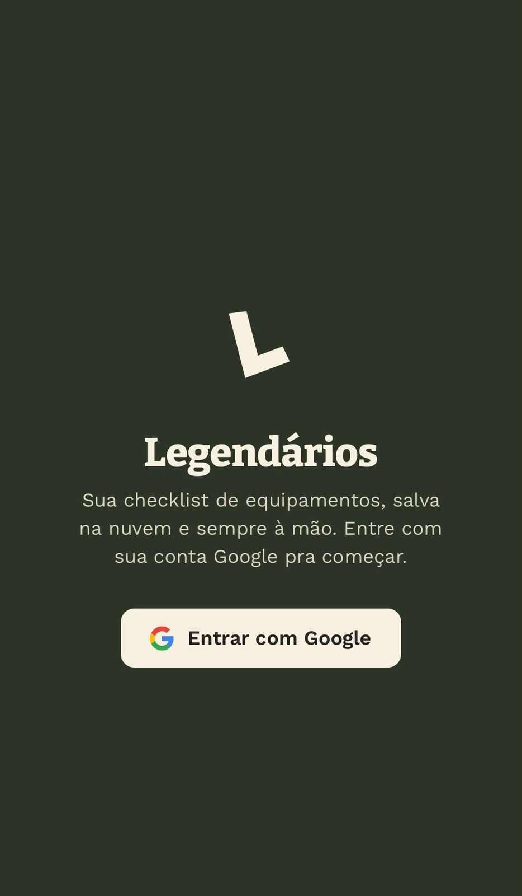
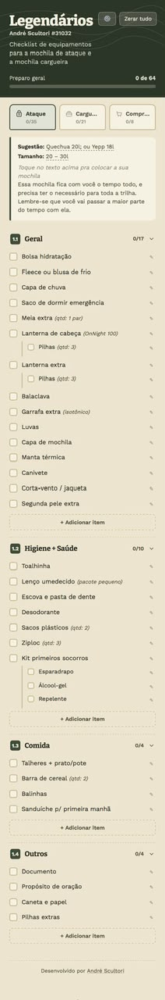
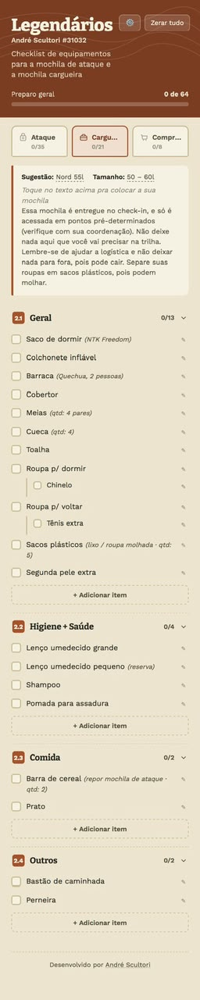
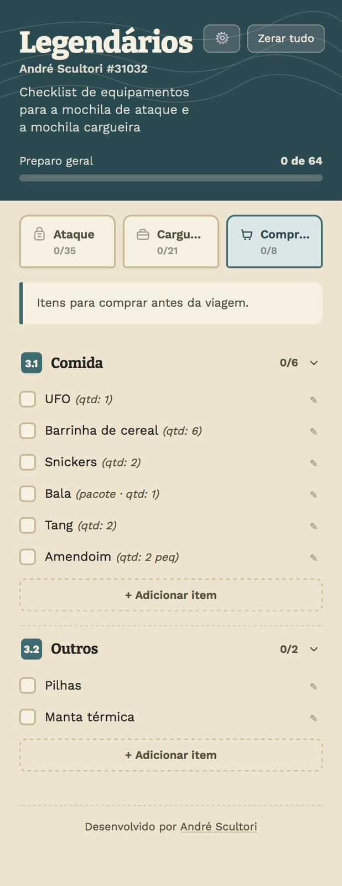
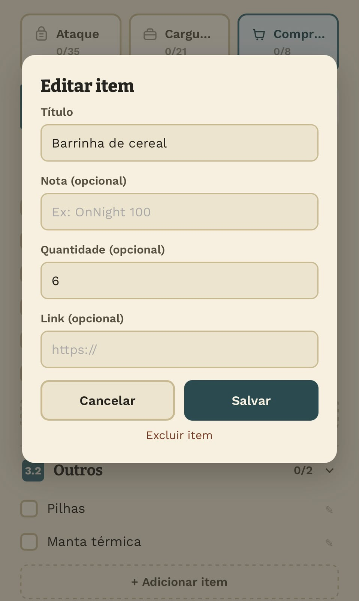

🇧🇷 Português | [🇺🇸 English](README.en.md)

# 🎒 Legendários — Checklist de Equipamentos

Checklist de equipamentos de trilha, salva na nuvem e sempre à mão — sem mais lista de papel se perdendo entre a mochila de ataque e a cargueira.

App web para os membros do grupo de trekking **Legendários** organizarem o que levar nas duas mochilas da trilha (ataque e cargueira) e o que ainda falta comprar, com progresso salvo por usuário e sincronizado em tempo real.

> Este é o app real usado pelo grupo em produção — o login é feito com conta Google de verdade e os dados ficam no banco real dos Legendários. Não há um modo demo separado; as capturas de tela abaixo mostram a interface funcionando com uma conta real (a minha).



## O problema original

Antes disso, a lista de equipamentos circulava como texto solto ou planilha — cada Legendário mantinha sua própria versão, sem padronização entre o que vai na mochila de ataque (a que fica com você o tempo todo na trilha) e o que vai na cargueira (entregue no check-in, acessada só em pontos pré-determinados). Fácil esquecer item, fácil perder o controle do que já foi separado ou comprado.

## A solução

```
Login com Google
      ↓
Perfil criado no Supabase (nome, nº de Legendário, pista, 1º TOP)
      ↓
Checklist padrão semeada automaticamente (3 packs, seções, itens e subitens)
      ↓
Progresso marcado item a item, sincronizado em tempo real na nuvem
```

O resultado: cada Legendário abre o app, vê exatamente o que falta separar em cada mochila, e pode ajustar a lista (adicionar, editar, remover itens) sem afetar a lista de mais ninguém.

## O checklist em si

- **Três packs organizados em abas** — Ataque, Cargueira e Comprar — cada um com progresso próprio e cor de destaque diferente
- **Seções numeradas e recolhíveis** (Geral, Higiene + Saúde, Comida, Outros), cada uma com contador de itens concluídos
- **Itens com subitens** — ex: "Lanterna de cabeça" com "3 pilhas" dentro, cada um marcável separadamente
- **Notas, quantidade e link opcional** por item (ex: modelo sugerido, link de compra)
- **Edição inline da sugestão e do tamanho de mochila** direto no texto, sem precisar abrir modal
- **Adicionar, editar e excluir itens** em qualquer seção, a qualquer momento
- **Barra de progresso geral** e por pack, atualizada em tempo real a cada item marcado
- **"Zerar tudo"** com confirmação, para reiniciar a checklist antes de uma nova trilha






## Stack técnica

| Camada | Tecnologia |
|---|---|
| Frontend | HTML, CSS e JavaScript puros — sem framework, sem build |
| Backend / dados | [Supabase](https://supabase.com) (Postgres + Realtime) |
| Autenticação | Supabase Auth com login via Google OAuth |
| Tipografia | Google Fonts (Bitter + Work Sans) |

## Por que sem framework

O app inteiro vive em um único `index.html`. A escolha foi deliberada: é um projeto pequeno, de escopo bem definido, para um grupo específico — não precisa de bundler, pipeline de build ou dependências além do cliente JS do Supabase via CDN. Isso significa que qualquer navegador abre o arquivo direto, sem etapa de deploy, e a manutenção fica trivial: uma pessoa só, sem stack de frontend, consegue editar o arquivo e publicar.

A segurança dos dados não depende de esconder a `anon key` do Supabase (ela é feita para ficar no cliente) — depende das políticas de Row Level Security configuradas no banco, que restringem cada usuário a ler e escrever apenas os próprios dados.

## Arquitetura

Toda a lógica está em [`index.html`](index.html):
- Tabelas do Supabase usadas: `profiles`, `checklist_items`, `pack_meta`
- Template padrão de itens (`TEMPLATE`) usado para semear a checklist de um usuário novo no primeiro login
- Fluxo de autenticação e cadastro (`boot`, `afterLogin`, `seedDefaultItems`)
- Renderização dos packs e seções (`renderPack`, `buildSections`)

## Rodando localmente

Não há build — é servir o arquivo estático:

```bash
git clone https://github.com/andrescultori/lgnd-checklist.git
cd lgnd-checklist
python3 -m http.server 8000
# abra http://localhost:8000
```

Para rodar com dados próprios (em vez do banco real dos Legendários), crie um projeto no Supabase, replique as tabelas `profiles`, `checklist_items` e `pack_meta`, e troque `SUPABASE_URL` e `SUPABASE_ANON_KEY` no topo do `<script>` em `index.html`.

---

*Este repositório é disponibilizado publicamente para fins de portfólio profissional. Trata-se do sistema real em produção para o grupo Legendários — veja a seção de licença para os termos de uso do código.*

Desenvolvido por [André Scultori](https://github.com/andrescultori)  ·  © 2026  ·  [GitHub](https://github.com/andrescultori/lgnd-checklist)
